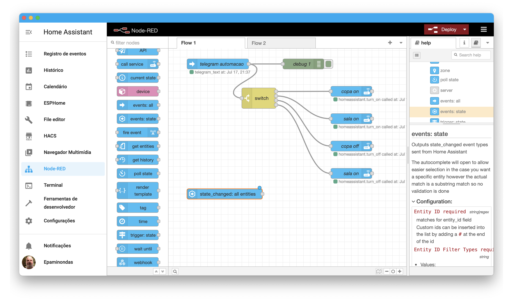
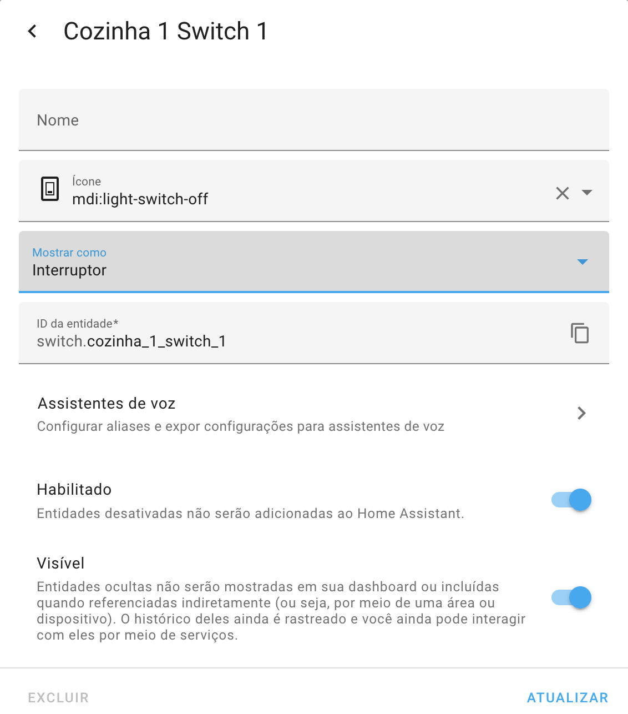
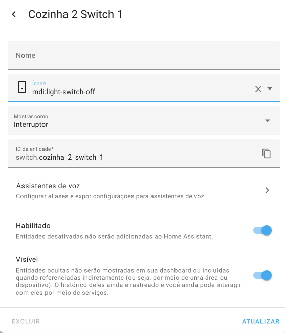
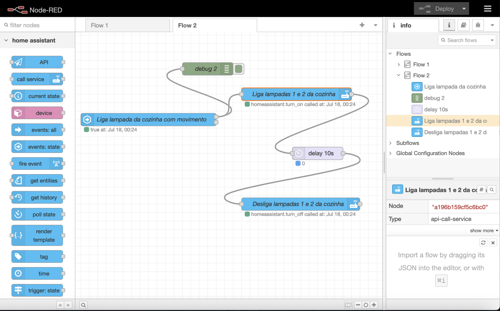
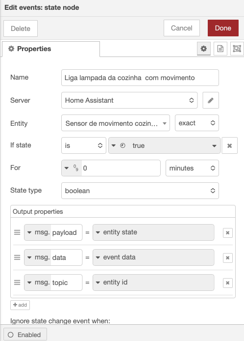
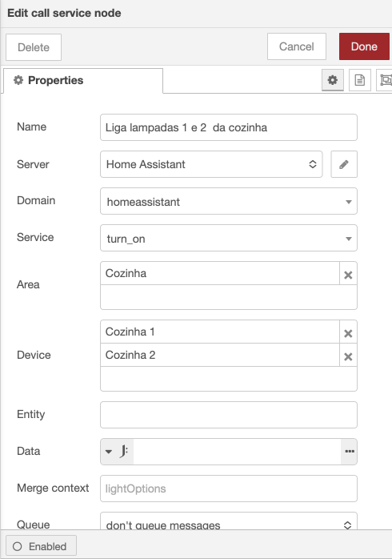
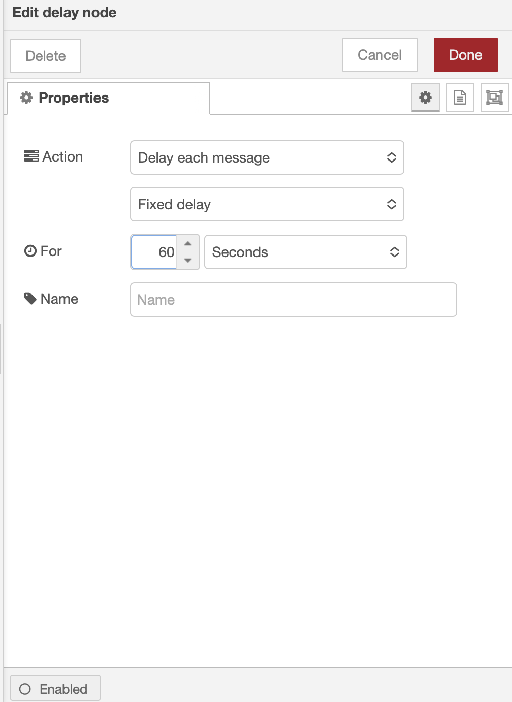
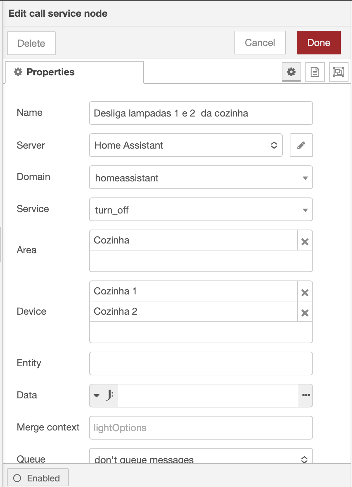
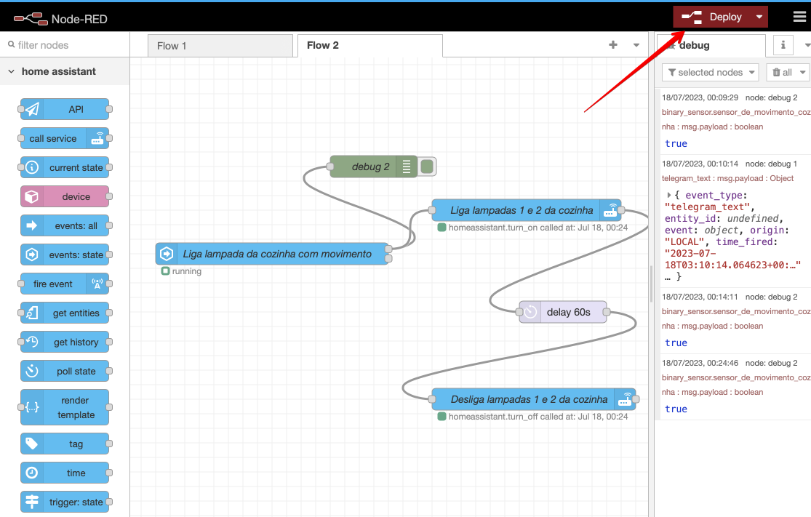

<td style="width: 20%;"></td>

<strong>Home Assistant - Node-RED</strong>

<strong>Prof Epaminondas Lage</strong>

<a href="http://lattes.cnpq.br/7787341723868111"> Currículo Lattes LAGE, E. S.</a> 

# Índice 

* [Sites relacionados ao Home Assistant e Node-RED ](Sites-relacionados-ao-Home-Assistant-e-Node-RED)
* [Introdução](#Introdução)
* [Repositório Disponível](Repositório-Disponível)    
* [Status do Projeto](Status-do-Projeto)

# Sites relacionados ao Home Assistant e Node-RED

* https://https://nodered.org/
* https://https://github.com/hassio-addons/addon-node-red
* 

# Introdução

## O que é Node-RED?

O Node-RED é uma ferramenta de desenvolvimento gráfico que facilita a conexão e automação de dispositivos de hardware, APIs e serviços online. Sua abordagem visual permite que desenvolvedores criem aplicações IoT (Internet das Coisas) industriais ou residenciais de maneira mais intuitiva e eficiente. Foi originalmente desenvolvido pela IBM para uso interno, mas tornou-se de código aberto em 2016.

O funcionamento do Node-RED é baseado na utilização de nós pré-construídos, que representam diferentes funcionalidades e serviços. Esses nós podem ser combinados em um fluxo, onde a mensagem, contendo uma carga útil de dados, é passada de nó para nó no fluxo. Cada nó executa uma tarefa específica, como coleta, processamento ou envio de dados.

A grande vantagem do Node-RED é que, graças à comunidade de código aberto e aos contribuidores ativos, há uma vasta biblioteca de nós disponíveis para diversas finalidades. Isso permite que desenvolvedores tenham acesso a uma ampla gama de funcionalidades prontas para uso, acelerando o processo de desenvolvimento e simplificando a conexão entre dispositivos e serviços.

Aspectos técnicos do Node-RED:
<ol> 
<li>Arquitetura: O Node-RED é construído em cima do ambiente Node.js, que é uma plataforma de execução de JavaScript. Ele usa a biblioteca Node.js "Express" para fornecer um servidor HTTP que hospeda o editor gráfico do Node-RED e executa os fluxos criados pelos usuários.</li>

<li>Editor gráfico: O ambiente de desenvolvimento do Node-RED é uma interface web que permite aos desenvolvedores criar e editar fluxos visualmente. Os nós pré-construídos são representados como blocos gráficos, e os desenvolvedores podem conectá-los arrastando e soltando conexões entre eles.</li>

<li>Flows (Fluxos): Um fluxo no Node-RED é uma sequência de nós conectados. Cada nó executa uma ação específica, como ler um dado de um sensor, processar informações, executar uma ação ou enviar dados para outro serviço. As mensagens (payloads) são passadas de um nó para outro através das conexões.</li>

<li>Nodes (Nós): Os nós são os componentes básicos de um fluxo. Existem diferentes tipos de nós que realizam diversas tarefas, e os desenvolvedores podem criar seus próprios nós personalizados, se necessário. Alguns exemplos de tipos de nós são: nós de entrada (recebem dados), nós de processamento (manipulam os dados) e nós de saída (enviam dados).</li>

<li>Biblioteca de nós: O Node-RED possui uma ampla biblioteca de nós pré-construídos disponíveis para uso. Isso inclui nós para integração com protocolos de comunicação, serviços web, bancos de dados, dispositivos IoT, entre outros. Os desenvolvedores podem instalar esses nós diretamente do gerenciador de pacotes do Node-RED ou criar seus próprios nós personalizados em JavaScript.</li>

<li>Comunicação entre nós: As mensagens, contendo dados (payloads) e metadados adicionais, são o mecanismo principal para a comunicação entre os nós. Cada nó pode processar a mensagem e decidir para onde enviá-la em seguida, permitindo fluxos de trabalho complexos e automatizados.</li>

<li>Integração com serviços online: O Node-RED oferece nós específicos para interagir com serviços populares, como MQTT (protocolo de mensagens para IoT), HTTP, TCP, bancos de dados, e-mail, serviços em nuvem, APIs de redes sociais, armazenamento em nuvem, entre outros.</li>

<li>Extensibilidade: A capacidade de criar nós personalizados em JavaScript permite que os desenvolvedores estendam o Node-RED e adicionem suporte para novos dispositivos, protocolos ou serviços, tornando-o altamente flexível e adaptável a diferentes cenários de aplicação.</li>

<li>Segurança: O Node-RED oferece funcionalidades de autenticação e autorização para proteger o acesso ao editor gráfico e aos fluxos criados. Também é possível configurar conexões seguras com serviços externos, utilizando protocolos criptografados e autenticação.</li>

<li>Implantação: Uma vez que o fluxo é criado e testado no ambiente de desenvolvimento, pode ser implantado em um ambiente de produção, onde os nós executarão suas tarefas de forma contínua, permitindo a automação efetiva e confiável de processos e sistemas.</li>
</ol>

Esses aspectos técnicos mostram como o Node-RED é uma ferramenta poderosa para desenvolvimento de aplicações IoT e automação, oferecendo uma abordagem gráfica e intuitiva para conectar e orquestrar dispositivos e serviços de maneira eficiente.

## O que é um Node?

Citando diretamente o site nodered.org – Um nó é o bloco de construção básico de um fluxo.
    
Os nós são acionados recebendo uma mensagem do nó anterior em um fluxo ou aguardando algum evento externo, como uma solicitação HTTP recebida, um cronômetro ou alteração de hardware GPIO. Eles processam essa mensagem ou evento e, em seguida, podem enviar uma mensagem para os próximos nós do fluxo. Um nó pode ter no máximo uma porta de entrada e quantas portas de saída forem necessárias.

Os nós podem ser pensados ​​como uma representação de algo acontecendo em uma casa inteligente. Por exemplo, existem nós “stoptimer” que acionarão um cronômetro com base na mensagem recebida e pararão esse cronômetro com base na mensagem recebida. Existem nós que monitoram eventos, seja de um serviço Home Assistant ou de um hardware em sua rede como um sensor de movimento, que será acionado com base em como foi configurado. Existem nós de serviço de chamada, que irão iniciar, parar ou alterar um serviço, como light.turn_on, light.turn_off e light.toggle. Estes são apenas alguns exemplos de quase inúmeros tipos de nós.

## Primeira automação nom Node-RED

Vamos fazer um exemplo simples de automação usando o Node-RED e o Home Assistant. Vamos criar uma automação para acender uma luz conectada a um dispositivo inteligente (como uma lâmpada controlada por um interruptor via Wi-Fi- Sonoff) quando um sensor de movimento Tuya for ativado.

Pré-requisitos:

    * O Node-RED e o Home Assistant configurados e em execução em sua rede.
    * Certifique-se de que o dispositivo de acionamento da luz (interruptor inteligente)  e o sensor de movimento estão integrados e funcionando corretamente no Home Assistant.
    

 
Fluxo do Node-RED para essa automação:

Abra o editor do Node-RED em seu navegador (normalmente, acessível ena própria interface do Home Assitant).

Arraste um nó "State" da paleta à esquerda para o canvas e configure-o para monitorar o estado do sensor de movimento.
Selecione a opção "Select a Home Assistant node" (Selecionar um nó do Home Assistant).

zazazazazazazazazazazazazazaz

 
Eaxaxaxaxaxaxaxaxaxaxaxaxaxaxax

xxxxxxxxxxsxsxsxsxsxsxxs

 
xxxxxxxxxxsxsxsxsxsxsxxs

 
fhfhgffgffhgfhgfhgfhgfhgffhffhgfhfghfhf

Feche a janela de configuração.
Salve o fluxo e clique em "Deploy" no canto superior direito para aplicar as alterações.

Agora, quando o sensor de movimento for ativado (detecção de movimento), a luz inteligente será acionada automaticamente por 60s e transcorrido este tempo desligará.

## Repositório Disponível  

* <a href="https://github.com/Epaminondaslage/xxxxxxxxxxxxxxxx">xxxxxxxxxxxxxxxxxxxxxxxxxx)</a> 

# Status do Projeto

